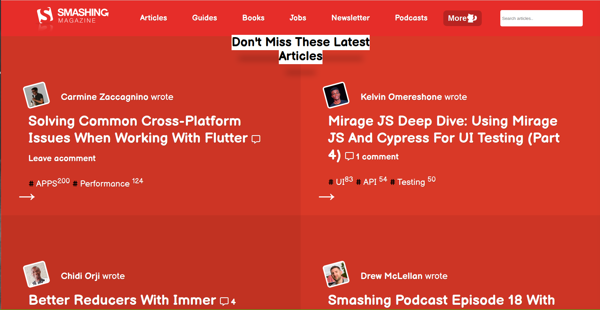

# Design Teardown
Microverse Collaborative Project (Berhanu and Umair)

Additional description about the project and its features.

## Built With

- HTML,
- CSS,

## Live Demo

[Live Demo Link](https://rawcdn.githack.com/umairarshadbutt/Design-Teardown/cfc400da6b29ec28eb50960ffb81cc1ff7566bd1/index.html)

## Getting Started

- Go to this old version of [smashingmagazine.com](https://www.smashingmagazine.com/) and have a look around. The form isn’t exceptionally complicat
This project is a Clone of this webpage.
We have a cloned webpage built with following features:

1. Map the elements of the Smashing homepage and how they are grouped together
2. Copy the basic structure of the page using empty semantic HTML elements that are appropriately sized and positioned
3. Change around the font styles and weights
4. Load in a few web fonts
5. A font/weight combination that approximates that of the original Smashing homepage and apply it to our solution

To get a local copy  and to set it up and running follow these simple example steps.

### Prerequisites

- Browser
- Internet

- Download the code from repository (https://github.com/umairarshadbutt/Design-Teardown/tree/new-feature) and double click the index.html file

## Authors

👤 **Umair Arshad**

- Github: [@umairarshadbutt](https://github.com/umairarshadbutt)
- Twitter: [@its_UmairArshad](https://twitter.com/its_UmairArshad)
- Linkedin: [umair-arshad-butt](https://www.linkedin.com/in/umair-arshad-butt/)

**Berhanu Tarekegn**

- Github: [@berhanu-tarekegn](https://github.com/berhanu-tarekegn)
- Linkedin: [Berhanu](https://www.linkedin.com/in/berhanu-tarekegn-687367123/)

## Show your support

Give a ⭐️ if you like this project!

## Acknowledgments

- Hat tip to anyone whose code was used
- Inspiration
- etc

## 📝 License

This project is [MIT](LICENSE) licensed.
